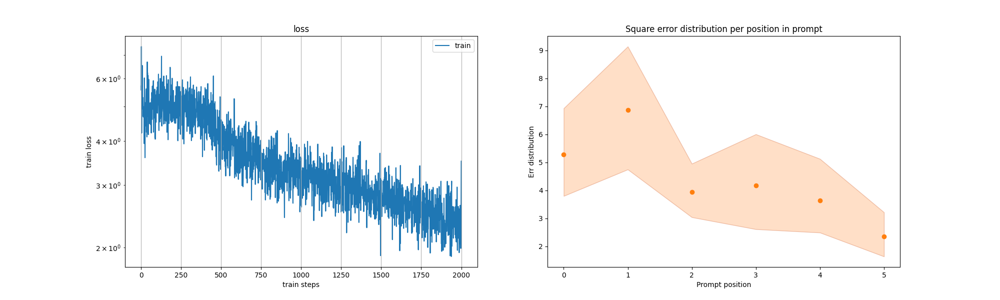
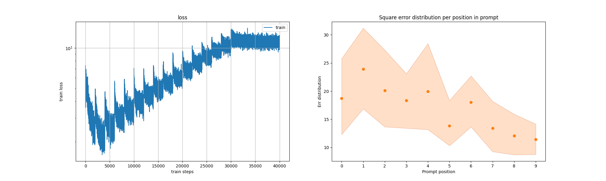
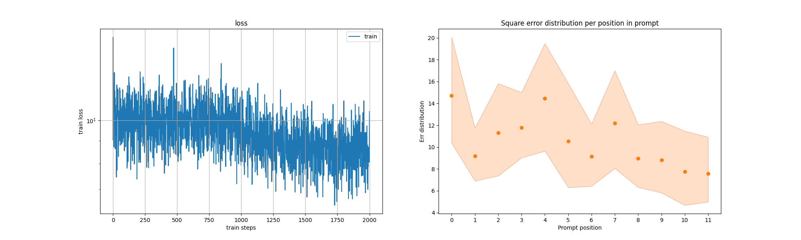
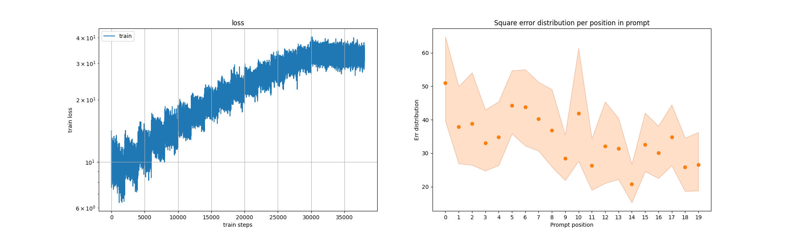
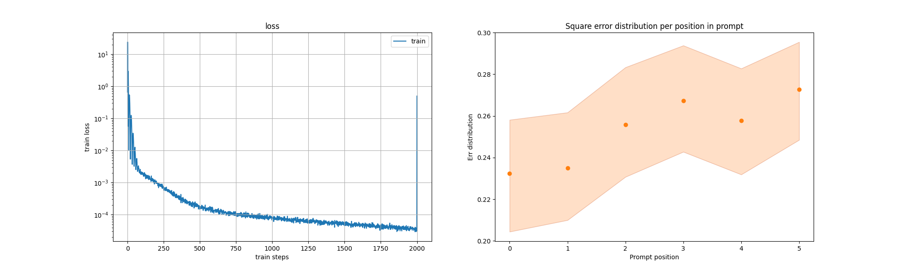
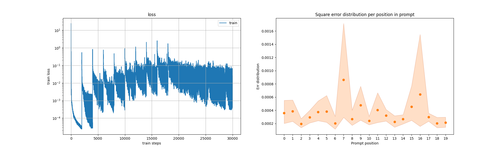

What Can Transformers Learn In-Context? A Case Study of Simple Function Classes
=========================================

This repository contains code of reproduced experiments from
paper [What Can Transformers Learn In-Context?](https://arxiv.org/pdf/2208.01066.pdf).

Specifically there are three settings of experiments:
* Experiment with linear functions from original paper;
* The same experiment, but the length of the prompt is doubled;
* Experiment with MNIST classification using MSE loss function;

### Launch

There are several command line arguments you may use to launch experiments:
* `--exp`: the type of experiments (`linear`, `dual` and `mnist` respectively);
* `--curriculum`: whether use curriculum (default is True);
* `--dim_start & --dim_max`: the initial and final dimension of embeddings 
(progress conducted by curriculum);
* `--len_start & --len_max`: initial and final length of prompt
(progress conducted by curriculum);
* `--update_steps`: number of train steps until curriculum update
parameters;

### My settings

In order to reproduce my results you should use the following arguments:

For linear experiment

``python main.py -e linear -ds 5 -dm 20 -ls 11 -lm 20 -us 2000``

For linear experiment with doubled prompt length

``pyhton main.py -e dual -ds 5 -dm 20 -ls 11 -lm 20 -us 3000``

For MNIST classification experiment

``pyhton main.py -e dual -ds 1 -dm 10 -ls 5 -lm 20 -us 1000``

### Results

Here I provide results of my experiments. For each experiment I place a pair
of plots: the first describes the behaviour of the model during initial epochs and
the second shows the results of training after 30000-50000 steps.

For linear experiment:

For linear experiment with doubled prompt length

For MNIST classification experiment

